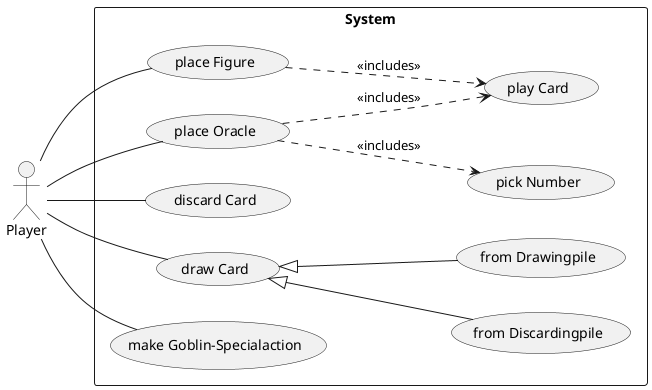

# DHL - Dire Horror Land

# Anforderungsdokumentation

## Anwendungsfalldiagramm



# Bedienungsanleitung

In diesem Dokument sollen alle Funktionen des Systems kurz vorgestellt werden und erklärt sein, wie diese angesteuert werden können.

# Architekturdokumentation

In diesem Dokument sollen die grundsätzlichen Ideen hinter der gewählten Architektur dargelegt werden. Es sollte erklärt werden, in welche Komponenten das System eingeteilt wurde, welche Klassen zur Umsetzung der einzelnen Komponenten dienen und welche Kommunikation zwischen den einzelnen Klassen stattfindet. Außerdem sollte klar werden, in wie fern die gewählte Architektur eine Erweiterbarkeit und einfache Wartbarkeit des Programms gewährleistet.

## Klassendiagramm

```plantuml
left to right direction
skinparam classAttributeIconSize 0
!theme plain


class Game {
    - FIELDS : Field[]
    - players : List<Player>
    - discardingPileJeFarbe : List<Card>
    - drawingPile : List<Card>
    
    + Game (playerAmount:int)
    
}
note right of Game::playerAmount  
    Player im Konstruktor mitgeben?
end note

class Player {
    - name : String
    - hand : List<Card>
    - victoryPoints : int
    - goblinSpecialPlayed : boolean 
    - playedCardsJeFarbeUndObAufAbsteigend : List<Card>
    
    + Player (name:String)
    
}

class Card {
    - color : char
    - number : int
    - oracleNumber : int
    
    + Card (color : char, number : int)
    + Card (color : char, number : int, oracleNumber : int)
}

class Field {
    - color : char
    - points : int
    - token : Token
}
class LargeField extends Field {
    -tokenTwo : Token
    
    + LargeField(points:int, color:char, wishingStoneAmount:int)
}
interface Token {
    + {abstract} collectable() : boolean
    + {abstract} getName() : String
    + {abstract} action()
}
class Goblin implements Token {
    + collectable() : boolean
    + getName() : String
    + action()
}
class WishingStone implements Token {
    + collectable() : boolean
    + getName() : String
    + action()
}

```

# Maven

Kurzübersicht nützlicher Maven-Befehle. Weitere Informationen finden sich im Tutorial:

* `mvn clean` löscht alle generierten Dateien
* `mvn compile` übersetzt den Code
* `mvn javafx:jlink` packt den gebauten Code als modulare Laufzeit-Image. Das Projekt kann danach gestartet werden mit `target/dhl/bin/dhl`
* `mvn test` führt die Tests aus
* `mvn compile site` baut den Code, die Dokumentation und die Tests und führt alle Tests, sowie JaCoCo und PMD inklusive CPD aus. Die Datei `target/site/index.html` bietet eine Übersicht über alle Reports.
* `mvn javafx:run` führt das Projekt aus
* `mvn javafx:run -Dargs="--no-gui"` führt das Projekt mit Command-Line-Parameter `--no-gui` aus.
